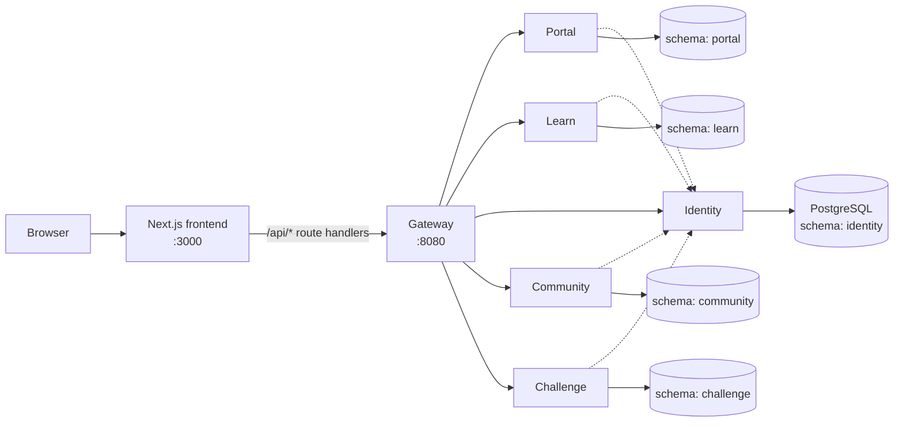

# Level 1 — Architecture

## 1. System shape

Seven deployables: one frontend, one gateway, five domain services. One PostgreSQL instance.

## 2. Components and responsibilities

| Component | Owns | Does not own |
| :-- | :-- | :-- |
| **Frontend** | All UI; a thin BFF layer (Next.js route handlers) that forwards to the gateway | Business rules, authorization decisions |
| **Gateway** | Public entry point; JWT verification; deciding which service a request targets; enriching requests with trusted headers | Any business data; issuing tokens |
| **Identity** | Users, credentials, per-service memberships and roles, JWT issuance; internal lookup API for other services | Anything a member *does* in a service |
| **Portal** | Home/admin features: info about the current member, member directory (read from identity), per-user settings, later announcements/events | User accounts |
| **Learn** | Courses, lessons; later progress and quizzes | — |
| **Community** | Forums, groups, messaging | — |
| **Challenge** | Contests, CTFs, judge, leaderboards | — |
| **PostgreSQL** | Durable storage for all of the above, one schema per service | — |

## 3. Key architectural decisions

### AD-1 Service-per-domain, schema-per-service
One process per functional area. Every service gets a dedicated PostgreSQL schema named after it (`identity`, `portal`, `learn`, `community`, `challenge`) and may only touch its own schema. Cross-service data needs are met by HTTP calls, never by SQL joins across schemas.
*Why:* independence of evolution (principle 2) with the operational simplicity of one database (principle 4).

### AD-2 Gateway-mediated ingress
Nothing from the outside talks to a domain service directly. The gateway:
1. resolves the **target service** from the request (subdomain first, explicit header second, `portal` default),
2. verifies the **JWT** if present,
3. forwards the request unchanged except for a fixed set of **trusted headers** it strips and re-adds.
*Why:* authentication logic lives in one place; services stay thin (principle 5).

### AD-3 Centralised identity, propagated context
Identity is the only issuer of tokens and the only owner of the user table. Downstream services receive the caller's user id in `X-User-Id` and, when they need a role, ask identity over an internal endpoint. Services never parse JWTs.
*Why:* principle 1; avoids sharing signing keys with every service.

### AD-4 Shared internal secret
Every hop gateway→service and service→identity carries `X-Internal-Auth: <INTERNAL_GATEWAY_SECRET>`. Services reject requests without it. This is the mechanism that makes "trust inside" safe when services are only reachable on a private network.
*Why:* cheap, stateless, adequate for a single-cluster deployment; can be replaced by mTLS later without changing service code shape.

### AD-5 Membership-based roles per service
A user has zero or one membership per service, each with a role string (`USER`, `ADMIN`). Registration grants `USER` in every service. Authorization inside a service is expressed as **policies** over that role.
*Why:* allows a club officer to be `ADMIN` in Portal but plain `USER` in Challenge.

### AD-6 External migrations
Flyway runs **outside** the applications (CLI locally, one-shot containers in Compose), one run per schema, each with its own history table. Applications start with `spring.flyway.enabled=false` and `ddl-auto=none`.
*Why:* schema changes are an explicit deploy step; six apps racing to migrate the same database is avoided.

### AD-7 Hand-written SQL over ORM
Data access through `JdbcTemplate`. Tables are simple, queries are few, and explicit SQL keeps the schema-per-service rule visible.

### AD-8 Frontend as BFF
The browser never calls the gateway directly. Next.js route handlers under `/api/*` forward to the gateway, adding the `X-Service-Name` header. Auth token lives in the browser and is passed through.
*Why:* single origin for the browser, place to hide gateway URL and to enrich/mock data during early development.

### AD-9 Subdomain per area
`portal.`, `community.`, `learn.`, `challenges.<root-domain>` map to areas in the frontend and to services in the gateway. Locally `*.localhost` is used.

## 4. Request lifecycle (the contract every service depends on)

1. Browser → frontend route handler with `Authorization: Bearer <jwt>` (from local storage).
2. Route handler → gateway, same path, plus `X-Service-Name: <service>`.
3. Gateway resolves service, validates JWT → attributes `authenticated`, `userId`, `email`.
4. Gateway forwards to `http://<service>:8080<path>` with:
   - stripped: `Authorization`, any incoming `X-User-Id`, `X-Internal-Auth`
   - added: `X-Internal-Auth`, `X-User-Id`, `X-Request-Id`
5. Service filter chain: verify `X-Internal-Auth` → bind `X-User-Id` to a request-scoped context → (optionally) ask identity for the caller's role → run policy → handle request against its own schema.
6. Response flows back unchanged.

Unauthenticated requests (no/invalid JWT) are **always routed to identity**, which is how `/signup` and `/signin` are reached without special-casing paths.

## 5. Cross-cutting concerns

| Concern | Approach |
| :-- | :-- |
| Correlation / tracing | Gateway generates a request id; services accept or generate a correlation id, echo it in responses, keep it in a request-scoped context for logs |
| Errors | Each service maps its domain exceptions to a uniform JSON error body (`error`, `message`, `path`, `correlationId`, `timestamp`) |
| Configuration | 12-factor: everything from environment variables; a `docker` Spring profile switches service URLs from `localhost:<port>` to `<service>:8080` |
| Observability | Spring Actuator on domain services (health); structured logs to stdout / per-service log files locally |

## 6. Deployment topology

- **Local (JVMs):** each service on its own port (identity 8082, portal 9000, learn 9002, community 9004, challenge 9006, gateway 8080), Postgres on host port 5433, frontend 3000.
- **Local (Compose):** every service in a container listening on 8080, published to the same host ports as above, Postgres on 5432, Flyway one-shot containers gating service start-up.
- **Later:** built images (each service has a multi-stage Dockerfile) pushed from CI.

## 7. Trade-offs accepted

- Extra latency: one identity call per authorised request (cacheable later).
- The gateway blocks a servlet thread per proxied request; acceptable at club scale.
- Shared secret rather than mTLS between services.
- Eventual consistency for anything that spans services; there are no distributed transactions.
