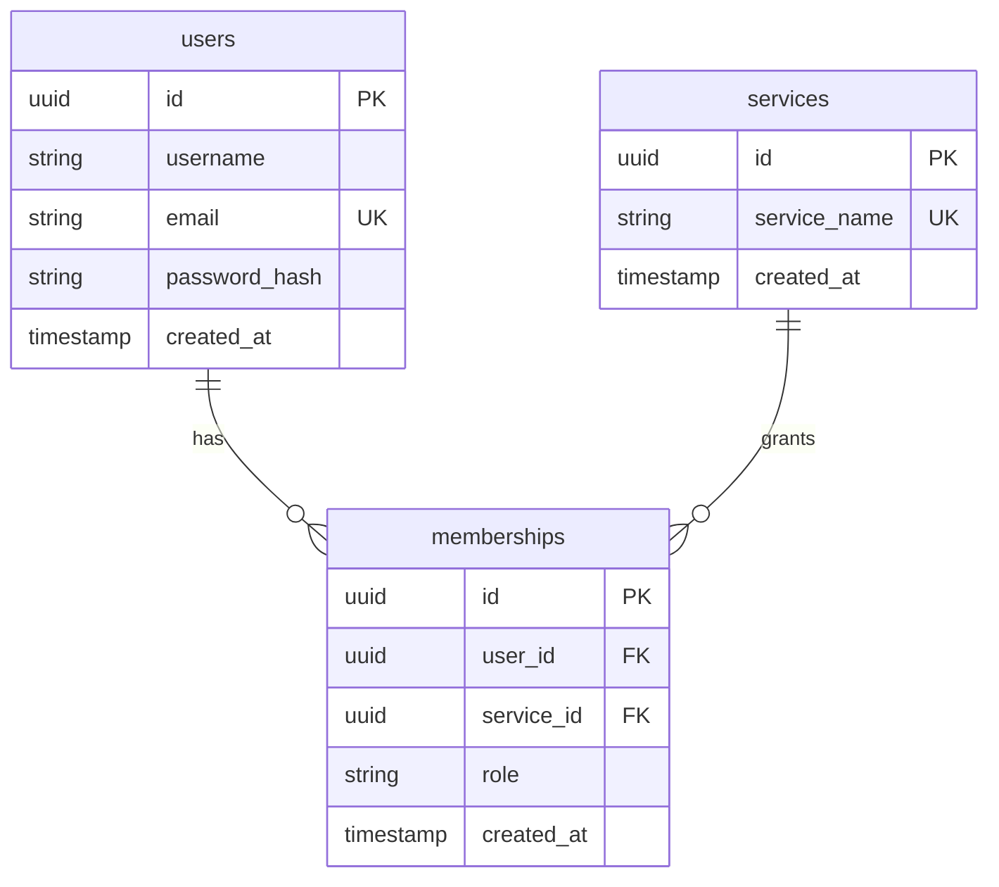

# Domain — Identity

**Level 2** · depends on AD-3, AD-5 · schema `identity`

## Responsibility

Own **who** a person is (user record, credentials), **where** they belong (membership + role per service), and **prove** it (JWT). Provide an internal lookup API so other services never touch the `identity` schema.

## Domain model

- `services` is seeded with exactly the service names the gateway routes to: `portal`, `community`, `challenge`, `learn`.
- `(user_id, service_id)` is unique — one role per user per service.
- `role` is a free string in v1 with two known values: `USER`, `ADMIN`.

## Public API (reached through the gateway; unauthenticated traffic lands here)

| Endpoint | Request | Response | Rules |
| :-- | :-- | :-- | :-- |
| `POST /signup` | `{username, email, password}` | `201 {accessToken, tokenType:"Bearer", expiresIn}` | e-mail unique; password BCrypt-hashed; on success create a `USER` membership in **every** seeded service; return a token immediately |
| `POST /signin` | `{email, password}` | `200 {accessToken, tokenType, expiresIn}` | constant-time hash compare; failure → "Invalid credentials" |

## Internal API (only for other services; requires `X-Internal-Auth`)

| Endpoint | Purpose | Response |
| :-- | :-- | :-- |
| `GET /private/api/member/check?userId&serviceName` | Authorization probe used by every service | `200 {allowed:true, role}` · `403 {allowed:false, role:null}` when no membership · `404` unknown service |
| `GET /private/api/{serviceName}/members` | Member directory for a service | `[{service_name, username, email, role, created_at}]` |
| `GET /private/api/{serviceName}/{userId}` | Single user + service record | `{service:{…}, user:{…}}` · `400` bad UUID · `404` |

## Token

HS256 · secret `JWT_SECRET` (min 32 chars, enforced at start-up) · claims `sub`=user id, `email`, `iss=identity-service`, `iat`, `exp` = now + `security.jwt.expiration` (900 s). No refresh token in v1.

## Security posture

- Every endpoint — including `/signup` and `/signin` — sits behind the `X-Internal-Auth` check. Identity is unreachable except via the gateway.
- Spring Security is present only for the `BCryptPasswordEncoder(12)` bean and to disable CSRF; request authorization is `permitAll` because the filter above already gates everything.

## Configuration

`DATABASE_URL`, `POSTGRES_USER`, `POSTGRES_PASSWORD`, `JWT_SECRET`, `INTERNAL_GATEWAY_SECRET`, `security.jwt.expiration=900`, `server.port=8082` (local).

## Tests

Integration tests on a Testcontainers PostgreSQL with the real Flyway migrations: register hashes password; duplicate e-mail rejected; login success / wrong password / unknown e-mail; JWT claims round-trip.

## Later

Global exception → status mapping (401 for bad credentials, 409 for duplicate e-mail); DTO validation and password policy; admin promotion endpoint; refresh tokens; OIDC (university SSO) as an additional credential source.
