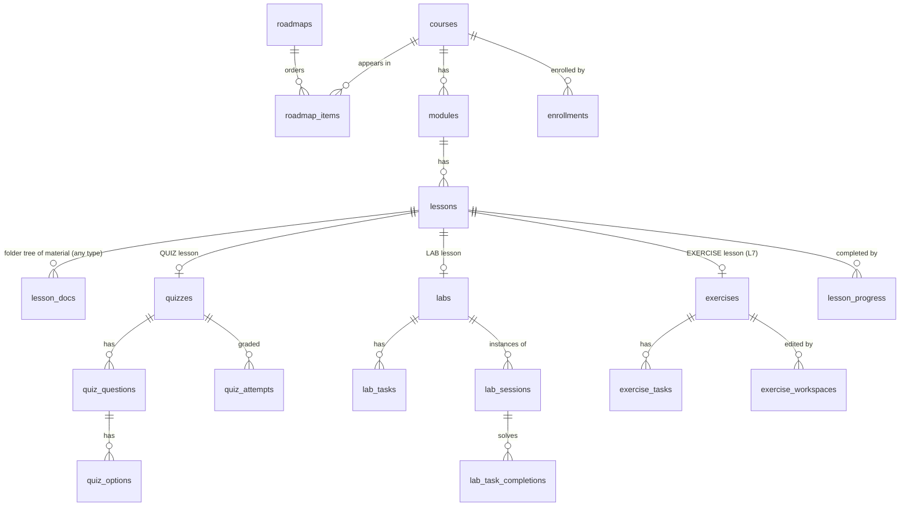

# Level 1 — Domain Model (Learn)

All tables live in schema `learn`. `user_id` columns hold `identity.users.id` UUIDs **without** a foreign key (schema-per-service, AD-1). Display names are fetched from identity at read time.

## 1. Entity relationship

## 2. Content aggregates (authored by `ADMIN`)

### `roadmaps`
| Column | Type | Notes |
| :-- | :-- | :-- |
| id | UUID PK | |
| slug | TEXT UNIQUE | URL key, e.g. `web-exploitation` |
| title, description_md | TEXT | |
| difficulty | `BEGINNER \| INTERMEDIATE \| ADVANCED` | |
| published | BOOLEAN | learners see only `true` |
| created_by | UUID | author user id |
| created_at, updated_at | TIMESTAMP | |

### `roadmap_items`
`(roadmap_id, course_id)` PK · `position INT` (unique per roadmap) · `required BOOLEAN` (counts toward roadmap completion). Linear order; no DAG prerequisites in Plan 01.

### `courses` (extends the Plan 00 baseline)
Adds `slug UNIQUE`, `difficulty`, `tags TEXT[]`, `published`, `created_by`, `updated_at`, `estimated_minutes INT` (derived cache). Keeps `id`, `title`, `description`, `created_at`.

### `modules`
`id, course_id → courses (CASCADE), title, description_md, position` — `UNIQUE (course_id, position)`.

### `lessons` (restructured)
| Column | Notes |
| :-- | :-- |
| id | |
| module_id → modules (CASCADE) | **replaces** `course_id` from V1 |
| title | |
| type | `READING \| VIDEO \| QUIZ \| LAB \| PROJECT \| EXERCISE` — `PROJECT` = "build this on your own machine", completes like `READING`; `EXERCISE` = code workspace graded by tests (L7) |
| content_md | markdown body / notes; nullable for `QUIZ`/`LAB`/`EXERCISE`; the intro for `PROJECT` |
| video_url | for `VIDEO` |
| position | `UNIQUE (module_id, position)` |
| estimated_minutes | |
| created_at, updated_at | |

### `quizzes` → `quiz_questions` → `quiz_options`
- `quizzes(id, lesson_id UNIQUE → lessons, pass_score INT /*0-100*/, shuffle BOOLEAN)`
- `quiz_questions(id, quiz_id, position, prompt_md, kind SINGLE|MULTI, points INT default 1)`
- `quiz_options(id, question_id, position, text_md, correct BOOLEAN)` — `correct` is **never** exposed in learner-facing GraphQL types.

### `labs` → `lab_tasks`
- `labs(id, lesson_id UNIQUE → lessons, title, brief_md, image_ref TEXT, exposed_port INT, ttl_minutes INT, cpu_millis INT, memory_mb INT, flag_mode STATIC|PER_SESSION)`
- `lab_tasks(id, lab_id, position, prompt_md, flag_hash TEXT /*SHA-256, STATIC mode*/, flag_env TEXT /*env var name, PER_SESSION mode*/, points INT, required BOOLEAN)`

### `lesson_docs` *(added 2026-09-21 — in V1)*
An optional **folder tree of extra material on any lesson**: a project specification split into folders/files, a tutorial video series, appendices to a long reading. `content_md` stays the lesson's main body; docs render below it like a repository browser.

- `lesson_docs(id, lesson_id → lessons (CASCADE), path TEXT, kind DOC|VIDEO, title, content_md, video_url, position, created_at, updated_at)`
- `path` is slash-separated (`setup/01-gateway.md`, `videos/02-routing`); **folders are implicit** from the segments — there is no folder table. `UNIQUE (lesson_id, path)`; a path may not be both a file and a folder (`a` and `a/b`); no `..`.
- `DOC` needs `content_md`; `VIDEO` needs `video_url` (with optional notes in `content_md`). CHECK-enforced.
- Replaced wholesale by `setLessonDocs`; list order becomes `position`.

### Projects — no table *(decision 2026-09-21)*
A project is a `PROJECT` lesson: the learner builds something on their own computer, in their own repo, following the lesson's body and doc tree (either as the last step of a module that walks through the build lesson by lesson, or as a stand-alone specification). **Nothing is submitted, stored, graded or reviewed by Learn**; completion is self-attested, exactly like a reading. Sharing the result and getting feedback is the Community service's responsibility. The earlier `projects` / `project_submissions` / `project_workspaces` designs were dropped for that reason.

### `exercises` → `exercise_tasks` *(L7 — sketch)*
The code-workspace case ("scaffold with handler + service + tests present; finish the repo layer"). Needs the platform to hold the learner's code and run the club's tests, so it sits on the lab-runner + judge.
- `exercises(id, lesson_id UNIQUE, template_ref, language, run_image, cpu_millis, memory_mb, timeout_s)`
- `exercise_tasks(id, exercise_id, position, prompt_md, test_selector, points, required, requires_previous)`
- learner side in §3.

## 3. Learner aggregates (written by `USER`)

| Table | Key | Columns | State machine |
| :-- | :-- | :-- | :-- |
| `enrollments` | `(user_id, course_id)` | `enrolled_at, completed_at` | created on `enroll`; `completed_at` set when every lesson in the course is complete |
| `lesson_progress` | `(user_id, lesson_id)` | `status STARTED\|COMPLETED, started_at, completed_at, meta JSONB` | `READING/VIDEO/PROJECT`: learner marks complete · `QUIZ`: passed attempt · `LAB`: all `required` tasks solved · `EXERCISE`: all `required` tasks have a `PASS` run |
| `quiz_attempts` | id | `quiz_id, user_id, answers JSONB /*{questionId:[optionId]}*/, score INT, passed BOOLEAN, submitted_at` | append-only; best attempt counts |
| `lab_sessions` | id | `lab_id, user_id, runner_instance_id TEXT, status, endpoint TEXT /*host:port*/, flags JSONB /*taskId→hash, PER_SESSION*/, started_at, expires_at, stopped_at, fail_reason` | `STARTING → RUNNING → STOPPED \| EXPIRED \| FAILED` (terminal states) |
| `lab_task_completions` | `(user_id, task_id)` | `session_id, completed_at` | insert on correct flag; idempotent |
| `exercise_workspaces` | `(user_id, exercise_id)` | `files JSONB /*path→content, editable subset only*/, updated_at` | mutable; one per learner per exercise, shared by all its tasks (L7) |
| `exercise_runs` | id | `user_id, task_id, verdict PASS\|FAIL\|ERROR\|TIMEOUT, output, ran_at` | append-only; best verdict per task counts (L7) |

## 4. Derived values (computed, not stored — except caches noted)

| Value | Rule |
| :-- | :-- |
| course progress % | `COMPLETED lesson_progress` in course / total lessons in course |
| course complete | progress = 100 % → set `enrollments.completed_at` (cache) |
| roadmap progress % | mean of course progress over `required` items |
| lab complete | every `required` task has a `lab_task_completions` row for the user |
| quiz best score | `MAX(score)` over attempts |
| exercise task passed | any `exercise_runs.verdict = PASS` for the (user, task) (L7) |
| `courses.estimated_minutes` | `SUM(lessons.estimated_minutes)` recomputed on lesson write (cache) |

## 5. Invariants

- A lesson of type `QUIZ`/`LAB`/`EXERCISE` must have exactly one child aggregate; enforced in the service layer at publish time (a path cannot be published with an incomplete typed lesson). `PROJECT` has no child aggregate and no publish guard.
- Unpublished content is invisible to `USER` in every query, including nested ones (a published roadmap referencing an unpublished path hides that item). `lesson_docs` inherit their lesson's visibility.
- At most `LAB_MAX_ACTIVE_SESSIONS_PER_USER` (default 1) sessions in `STARTING|RUNNING` per user.
- Flag comparison is constant-time on SHA-256 hashes; plaintext flags are never stored (STATIC) or stored only in the runner's process env for the session lifetime (PER_SESSION — Learn stores the hash).
- Deleting a course cascades content but **never** deletes learner rows; `lesson_progress`/`quiz_attempts` rows referencing deleted lessons are removed by the same cascade only for lessons, and enrollments keep `completed_at` history via `ON DELETE SET NULL`-free design: courses are soft-deleted (`published=false` + `archived_at`) in Plan 01; hard delete is an operator action.
