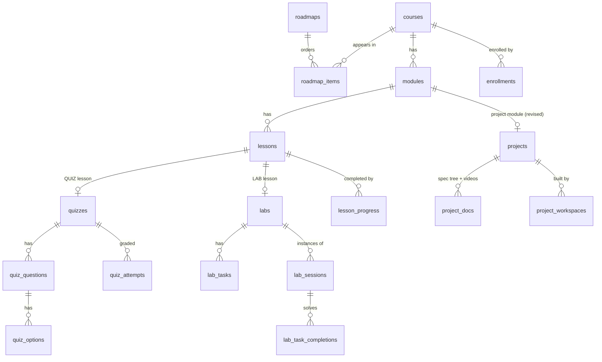

# Level 1 — Domain Model (Learn)

All tables live in schema `learn`. `user_id` columns hold `identity.users.id` UUIDs **without** a foreign key (schema-per-service, AD-1). Display names are fetched from identity at read time.

## 1. Entity relationship

## 2. Content aggregates (authored by `ADMIN`)

### `roadmaps`
| Column | Type | Notes |
| :-- | :-- | :-- |
| id | UUID PK | |
| slug | TEXT UNIQUE | URL key, e.g. `web-exploitation` |
| title, description_md | TEXT | |
| difficulty | `BEGINNER \| INTERMEDIATE \| ADVANCED` | |
| published | BOOLEAN | learners see only `true` |
| created_by | UUID | author user id |
| created_at, updated_at | TIMESTAMP | |

### `roadmap_items`
`(roadmap_id, course_id)` PK · `position INT` (unique per roadmap) · `required BOOLEAN` (counts toward roadmap completion). Linear order; no DAG prerequisites in Plan 01.

### `courses` (extends the Plan 00 baseline)
Adds `slug UNIQUE`, `difficulty`, `tags TEXT[]`, `published`, `created_by`, `updated_at`, `estimated_minutes INT` (derived cache). Keeps `id`, `title`, `description`, `created_at`.

### `modules`
`id, course_id → courses (CASCADE), title, description_md, position` — `UNIQUE (course_id, position)`.

### `lessons` (restructured)
| Column | Notes |
| :-- | :-- |
| id | |
| module_id → modules (CASCADE) | **replaces** `course_id` from V1 |
| title | |
| type | `READING \| VIDEO \| QUIZ \| LAB \| PROJECT` (`EXERCISE` reserved, not used) |
| content_md | markdown body / notes; nullable for `QUIZ`/`LAB`/`PROJECT` |
| video_url | for `VIDEO` |
| position | `UNIQUE (module_id, position)` |
| estimated_minutes | |
| created_at, updated_at | |

### `quizzes` → `quiz_questions` → `quiz_options`
- `quizzes(id, lesson_id UNIQUE → lessons, pass_score INT /*0-100*/, shuffle BOOLEAN)`
- `quiz_questions(id, quiz_id, position, prompt_md, kind SINGLE|MULTI, points INT default 1)`
- `quiz_options(id, question_id, position, text_md, correct BOOLEAN)` — `correct` is **never** exposed in learner-facing GraphQL types.

### `labs` → `lab_tasks`
- `labs(id, lesson_id UNIQUE → lessons, title, brief_md, image_ref TEXT, exposed_port INT, ttl_minutes INT, cpu_millis INT, memory_mb INT, flag_mode STATIC|PER_SESSION)`
- `lab_tasks(id, lab_id, position, prompt_md, flag_hash TEXT /*SHA-256, STATIC mode*/, flag_env TEXT /*env var name, PER_SESSION mode*/, points INT, required BOOLEAN)`

### `projects` → `project_docs` *(revised 2026-09-21 — project-based learning, no grading)*

A project is attached to a **module**, not a lesson: the module *is* the project. Two shapes, one model:

| Shape | Module contents | How the learner works |
| :-- | :-- | :-- |
| **Guided** | step lessons (`READING`/`VIDEO`: "1. gateway skeleton", "2. host routing", …) ending in one `PROJECT` lesson | follows the steps in the app, builds on their own machine, records the repo in their workspace, marks the `PROJECT` lesson complete |
| **Spec-only** | a single `PROJECT` lesson | reads the **specification** (document tree) and/or watches the **tutorial videos**, builds entirely outside the app in their own repo, records the repo, marks complete |

- `projects(id, module_id UNIQUE → modules, title, brief_md, deliverable REPO_URL|WRITEUP|BOTH|NONE, visibility PRIVATE|PEERS, feedback NONE|OPTIONAL)`
  - `deliverable` — what must be present in the learner's workspace before the `PROJECT` lesson may be marked complete. `NONE` = pure self-attestation.
  - `visibility` — `PEERS` lets learners opt in to a **showcase**; `PRIVATE` disables it entirely.
  - `feedback` — `OPTIONAL` lets an author leave a note on a workspace. It is a comment, never a verdict.
- `project_docs(id, project_id, path TEXT, kind DOC|VIDEO, title, content_md, video_url, position)` — the **specification**. `path` is slash-separated (`setup/01-gateway.md`, `videos/02-routing`); folders are implicit from path segments, so the UI renders the spec like a repository file tree. `UNIQUE (project_id, path)`. A spec may be one document, a whole folder structure, a video series, or a mix. Rendered read-only for learners; authored as a tree in the editor.

There is **no rubric**, **no reviewer**, **no status machine**. See §3 for the learner side.

## 3. Learner aggregates (written by `USER`)

| Table | Key | Columns | State machine |
| :-- | :-- | :-- | :-- |
| `enrollments` | `(user_id, course_id)` | `enrolled_at, completed_at` | created on `enroll`; `completed_at` set when every lesson in the course is complete |
| `lesson_progress` | `(user_id, lesson_id)` | `status STARTED\|COMPLETED, started_at, completed_at, meta JSONB` | `READING/VIDEO`: learner marks complete · `QUIZ`: passed attempt · `LAB`: all `required` tasks solved · `PROJECT`: learner marks complete **and** the module's project `deliverable` is satisfied by their workspace |
| `quiz_attempts` | id | `quiz_id, user_id, answers JSONB /*{questionId:[optionId]}*/, score INT, passed BOOLEAN, submitted_at` | append-only; best attempt counts |
| `lab_sessions` | id | `lab_id, user_id, runner_instance_id TEXT, status, endpoint TEXT /*host:port*/, flags JSONB /*taskId→hash, PER_SESSION*/, started_at, expires_at, stopped_at, fail_reason` | `STARTING → RUNNING → STOPPED \| EXPIRED \| FAILED` (terminal states) |
| `lab_task_completions` | `(user_id, task_id)` | `session_id, completed_at` | insert on correct flag; idempotent |
| `project_workspaces` | `(user_id, project_id)` | `repo_url, writeup_md, shared BOOLEAN default false, created_at, updated_at, feedback_md, feedback_by, feedback_at` | **mutable**, one row per learner per project — the living artifact they keep editing while they build. No status. `shared` is the learner's opt-in to the showcase (only effective when `projects.visibility = PEERS`). `feedback_*` is an optional author note; it changes nothing else. |

## 4. Derived values (computed, not stored — except caches noted)

| Value | Rule |
| :-- | :-- |
| course progress % | `COMPLETED lesson_progress` in course / total lessons in course |
| course complete | progress = 100 % → set `enrollments.completed_at` (cache) |
| roadmap progress % | mean of course progress over `required` items |
| lab complete | every `required` task has a `lab_task_completions` row for the user |
| quiz best score | `MAX(score)` over attempts |
| project deliverable met | `deliverable = NONE`, or `repo_url` present (`REPO_URL`), or `writeup_md` present (`WRITEUP`), or both (`BOTH`) — checked at `completeLesson` time for the module's `PROJECT` lesson |
| project showcase | workspaces where `projects.visibility = PEERS` **and** `shared = true`, visible only to learners with a `module_progress` row for that module (you must have started the project to see others' builds) |
| `courses.estimated_minutes` | `SUM(lessons.estimated_minutes)` recomputed on lesson write (cache) |

## 5. Invariants

- A lesson of type `QUIZ`/`LAB` must have exactly one child aggregate, and a module containing a `PROJECT` lesson must have exactly one `projects` row; enforced in the service layer at publish time (a path cannot be published with an incomplete typed lesson). A module has at most one `PROJECT` lesson.
- Unpublished content is invisible to `USER` in every query, including nested ones (a published roadmap referencing an unpublished path hides that item). Project showcases are visible only to learners who have started the module; workspaces are visible only to their owner, to authors, and — when shared under `PEERS` — to those peers.
- At most `LAB_MAX_ACTIVE_SESSIONS_PER_USER` (default 1) sessions in `STARTING|RUNNING` per user.
- Flag comparison is constant-time on SHA-256 hashes; plaintext flags are never stored (STATIC) or stored only in the runner's process env for the session lifetime (PER_SESSION — Learn stores the hash).
- Deleting a course cascades content but **never** deletes learner rows; `lesson_progress`/`quiz_attempts` rows referencing deleted lessons are removed by the same cascade only for lessons, and enrollments keep `completed_at` history via `ON DELETE SET NULL`-free design: courses are soft-deleted (`published=false` + `archived_at`) in Plan 01; hard delete is an operator action.
