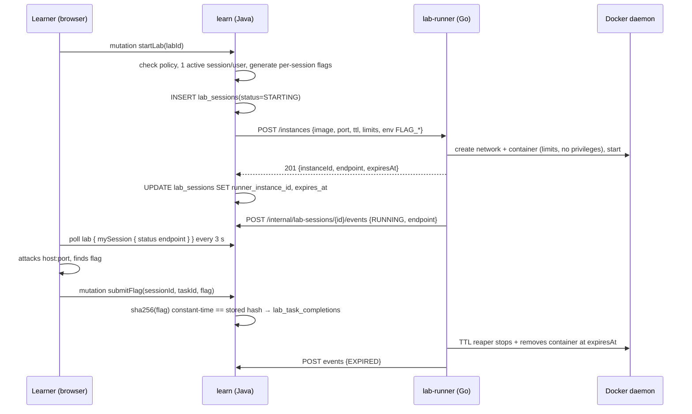

# Level 3 — Labs & the lab-runner (Go)

## 1. What a lab is, end to end



## 2. Why a separate component, and why Go

**Separate:** running arbitrary attacker-controlled interaction against containers must not share a process, credentials or network namespace with the service that holds course data and calls identity. The runner is the only component with access to the Docker socket.

**Go, specifically:**

| Need | Go fact |
| :-- | :-- |
| Talk to the Docker Engine (create/start/inspect/kill, networks, resource limits) | `github.com/docker/docker/client` is the reference SDK — Docker itself is Go |
| Enforce TTLs and clean up thousands of containers over a semester | goroutine + `time.Ticker` reaper, `context` cancellation; trivial concurrency model for a supervisor |
| Later: per-user networks, WireGuard peers, nftables rules (Challenge CTF) | `vishvananda/netlink`, `wgctrl-go` are Go-native; no Java equivalents without JNI |
| Small, auditable, minimal attack surface | single static binary, `FROM scratch`/distroless image, no JVM in the privileged container |

Rejected: doing this inside `learn` with a Java Docker client (`docker-java`) — works, but puts the Docker socket in the same container as the DB credentials and identity client; and Python — fine ecosystem, but the reaper/concurrency story and static deployment are weaker, and Python is already earmarked for the judge.

**Ownership:** `lab-runner` is **domain-neutral infrastructure**. It stores no business data (no schema), knows nothing about users, lessons or flags beyond opaque labels/env, and exposes a generic "run this image for N seconds" API. Learn (labs) and later Challenge (CTF instances) are both clients. This is the same component the README lists as "CTF infrastructure controller"; one codebase, one container.

## 3. Runner contract (REST, internal)

Base path `/`; every request requires `X-Internal-Auth` (constant-time compare with `INTERNAL_GATEWAY_SECRET`). Not routed by the gateway; only reachable on `app-network`.

| Method & path | Request | Response |
| :-- | :-- | :-- |
| `POST /instances` | `{ sessionId, image, exposedPort, ttlSeconds, cpuMillis, memoryMb, env: {k:v}, labels: {k:v}, callbackUrl }` | `201 { instanceId, endpoint, expiresAt }` · `400` invalid · `403` image not in allowlist · `429` global capacity reached · `502` Docker error |
| `GET /instances/{id}` | — | `200 { instanceId, status, endpoint, expiresAt, failReason }` · `404` |
| `DELETE /instances/{id}` | — | `204` (idempotent) |
| `GET /instances?label=owner=learn` | — | `200 [ … ]` (ops / reconciliation) |
| `GET /healthz` | — | `200` if Docker ping succeeds |

Status machine inside the runner: `STARTING → RUNNING → STOPPED | EXPIRED | FAILED`. Every transition is `POST`ed to `callbackUrl` (`http://learn:8080/internal/lab-sessions/{sessionId}/events`) with `X-Internal-Auth`; delivery is best-effort with 3 retries, and Learn polls `GET` as fallback, so the runner needs no persistence.

**Source of truth for "what is running" = Docker labels.** Every container is created with labels `ccp.owner`, `ccp.sessionId`, `ccp.expiresAt`, `ccp.userId`. On start-up the runner lists containers by label and rebuilds its in-memory table; the reaper works off `ccp.expiresAt`. No database, no file state.

## 4. Isolation requirements (non-negotiable before L6 is "done")

| Control | Setting |
| :-- | :-- |
| Image allowlist | `LAB_IMAGE_ALLOWLIST` (prefix list, e.g. `ghcr.io/cyberclub/labs/`); Learn additionally only passes `labs.image_ref` values |
| Privileges | `--cap-drop ALL`, `--security-opt no-new-privileges`, non-root user if the image allows, `--read-only` + `tmpfs /tmp` when the lab permits |
| Resources | `--cpus`, `--memory`, `--memory-swap = memory`, `--pids-limit 256`, `--ulimit nofile` |
| Network | one bridge network **per session** (`ccp-<sessionId>`), `--publish 127.0.0.1::<exposedPort>` → runner then exposes it via `LAB_PUBLIC_HOST:<hostPort>`; no access to `app-network`; egress blocked by default (`--internal` network) unless the lab declares `egress: true` |
| Docker socket | mounted **only** into `lab-runner`; never into a lab container |
| TTL | hard stop at `expiresAt` regardless of activity; `LAB_MAX_TTL_SECONDS` caps requests |
| Capacity | `LAB_MAX_INSTANCES` global; Learn enforces 1 active session per user |
| Secrets | flags arrive as env vars per session and exist only in that container's process env |

## 5. Flags

- **STATIC** (L6 v1): author enters plaintext flags in the UI; Learn stores `sha256(flag)` in `lab_tasks.flag_hash`. Image has the flag baked in. Weakness: learners can share flags.
- **PER_SESSION** (L6 v2): Learn generates `FLAG{<uuid4>}` per task at `startLab`, stores hashes in `lab_sessions.flags`, passes plaintext in `env` (`lab_tasks.flag_env` = variable name). The lab image reads the env var at start-up and places it where the challenge expects (a small entrypoint script convention documented for lab authors). Sharing a flag then proves nothing.
- Comparison always `MessageDigest.isEqual(sha256(submitted), stored)`, in Java.

## 6. Learn-side responsibilities

- `LabService.start`: policy → active-session check → flag generation → insert `STARTING` → `LabRunnerClient.create` → update ids; on runner error mark `FAILED` with reason.
- `LabService.stop` / `adminStop`: `DELETE /instances/{id}` → `STOPPED`.
- `LabEventsController` (`/internal/**`, behind `GatewayTrustFilter`): applies runner events; ignores stale/out-of-order transitions.
- `LabReconciler` (`@Scheduled` every 60 s): for sessions `STARTING|RUNNING` past `expires_at + grace`, `GET` the runner and mark `EXPIRED`/`FAILED`; for sessions the runner no longer knows, mark `FAILED("instance vanished")`.
- `LabRunnerClient`: `WebClient` with `labrunner.base-url`, `InternalAuthFilter`, 5 s connect / 30 s read timeouts.

## 7. Repository layout & ops

```
lab-runner/
├── go.mod                  # module github.com/cyberclub/lab-runner, Go 1.22+
├── cmd/lab-runner/main.go  # flags/env → server
├── internal/api/           # HTTP handlers, auth middleware (X-Internal-Auth)
├── internal/docker/        # engine client wrapper: create/start/inspect/remove, network per session
├── internal/store/         # in-memory instance table rebuilt from labels
├── internal/reaper/        # TTL loop
├── internal/callback/      # POST events with retry
├── Dockerfile              # golang:1.22 build → distroless/static; runs as root only because of the socket
└── README.md
```

| Setting | Env |
| :-- | :-- |
| listen | `PORT=8080` (container) / `9010` local |
| auth | `INTERNAL_GATEWAY_SECRET` |
| Docker | `DOCKER_HOST` (default unix socket) |
| limits | `LAB_MAX_INSTANCES=20`, `LAB_MAX_TTL_SECONDS=7200`, `LAB_IMAGE_ALLOWLIST` |
| exposure | `LAB_PUBLIC_HOST=localhost` (what learners connect to) |

Compose: service `lab-runner`, `volumes: /var/run/docker.sock:/var/run/docker.sock`, `networks: app-network`, no published ports except for local debugging (`9010:8080`). Learn gets `LABRUNNER_BASE_URL=http://lab-runner:8080`.

Makefile: a `GO_SERVICES=lab-runner` list with `go build ./... && go test ./...`, started alongside the Java loop.

CI: add `lab-runner` to the matrix with `actions/setup-go`; unit tests only (Docker integration test tagged `//go:build integration`).

## 8. Tests

| Layer | What |
| :-- | :-- |
| Go unit | state machine transitions; allowlist matcher; label → instance rebuild; reaper picks the right containers (fake clock) |
| Go integration (`-tags integration`) | against local Docker: create → RUNNING → DELETE; TTL 5 s → EXPIRED; callback received by an `httptest.Server` |
| Java integration | `LabService` with MockWebServer runner: happy path, runner 429/502 → `FAILED`, second `startLab` while active → `BadRequest`, wrong/correct flag, lab completion → lesson `COMPLETED` |
| Manual | two users, same lab, distinct endpoints, neither can reach the other's container |

## 9. Reuse by Challenge (Plan 02)

Challenge's CTF instances call the same `POST /instances` with `labels.owner=challenge`. Additions Challenge will need, deliberately **not** built here: multi-container labs (compose-like specs), WireGuard peer provisioning, team-shared instances. The runner's API is versioned (`/v1/…` if any of these force a break).
