# Level 4 — Roadmap (Plan 01 · Learn)

Each phase ends in something a learner or author can **use**, not just an API. Backend (migration + resolvers + tests) and the matching frontend ship together; a phase is not done until its "done when" is demonstrated through the browser against the Compose stack.

```mermaid
gantt
    dateFormat  X
    axisFormat  %s
    section Harden
    L0 Authorization, errors, tests          :l0, 0, 1
    section Content
    L1 Content model v2 + authoring + reader :l1, after l0, 3
    L2 Enrollment & progress                 :l2, after l1, 2
    L3 Roadmaps                              :l3, after l2, 1
    section Assessment
    L4 Quizzes                               :l4, after l2, 2
    L5 Projects & review                     :l5, after l4, 2
    section Hands-on
    L6 Labs + lab-runner (Go)                :l6, after l3, 4
    section Finish
    L7 Polish, seed, snapshot                :l7, after l6, 1
```

L3 and L4 are independent after L2; L6 can start once L3 is done (labs are lessons; roadmaps only affect navigation).

---

## L0 — Harden the baseline

*Make the Plan 00 slot a real service before adding anything to it.*

- Copy Portal's `security/` (`AuthPolicy`, `Policies`, `ClientAuth`, `AuthResult`) and `AuthService` into `learn`; add `Policies.LEARNER = MEMBER.or(ADMIN)`, `Policies.AUTHOR = ADMIN`.
- `auth.require(LEARNER)` on `courses`/`course`, `auth.require(AUTHOR)` on `createCourse`/`createLesson` (still the baseline schema).
- `GraphQlExceptionResolver` (`DataFetcherExceptionResolverAdapter`) mapping domain exceptions → `ErrorType`, `extensions.correlationId`.
- `JwtFilter` → reject with 401 when `X-User-Id` is missing (align with Portal; anonymous access to Learn makes no sense once every resolver requires a policy).
- Rename `CourseSerivce` → `CourseService`. Disable GraphiQL in the `docker` profile.
- Tests: `BaseIntegrationTest` + `TestFlywayConfig` (`../infra/migrations/learn`), MockWebServer identity; `GraphQlTester` cases: USER can query, USER mutation → `FORBIDDEN`, ADMIN mutation → ok, missing user id → 401, identity 5xx → `INTERNAL_ERROR`.

**Done when:** `./mvnw test` in `learn` is green with ≥ 5 GraphQL tests, and through the gateway a `USER` token can run `courses` but gets `FORBIDDEN` on `createCourse`.

## L1 — Content model v2, authoring, reader

- Migration **V2** (slug, difficulty, tags, published, modules, typed lessons, data move).
- Schema: `Course.modules`, `Module.lessons`, `Lesson{type, contentMd, videoUrl}`, `courses(filter)`, `course(slug)`, `lesson(id)`; author mutations `upsertCourse`, `upsertModule`, `upsertLesson`, `reorder`, `publish(COURSE)`. Remove `createCourse`/`createLesson`.
- Visibility: learner queries filter `published = true` in repositories; `@BatchMapping` for `modules`/`lessons`.
- Frontend: `/api/learn/graphql` route; codegen; `/learn` catalogue (courses only), `/learn/courses/[slug]`, lesson player for `READING`/`VIDEO` (no completion yet); `/learn/admin` tree + `/learn/admin/courses/[id]` editor with markdown preview.
- Tests: visibility matrix (unpublished hidden from USER, visible to ADMIN), reorder validation, slug uniqueness → `BAD_REQUEST`.

**Done when:** an ADMIN creates a course with two modules and three lessons in the UI, publishes it, and a USER reads all three lessons at `/learn/courses/<slug>/lessons/<id>`; unpublished courses are invisible to the USER.

## L2 — Enrollment & progress

- Migration **V3** (`enrollments`, `lesson_progress`).
- Schema: `enroll`, `completeLesson`, `Course.enrollment`, `Course.progress`, `Lesson.myProgress`, `myEnrollments`. Completing a lesson without enrollment enrolls implicitly.
- Course completion cache (`enrollments.completed_at`) computed in the same transaction as the last lesson completion.
- Frontend: enroll button, progress bars on catalogue/course pages, "Mark complete" + auto-advance in the player, "continue" strip on `/learn`, real "Continue learning" card on the portal dashboard.
- Tests: progress arithmetic, idempotent complete, implicit enroll, completion cache.

**Done when:** a USER enrolls, completes lessons, sees the course reach 100 %, and the dashboard's "Continue learning" links to the next incomplete lesson of another enrolled course.

## L3 — Roadmaps

- Migration **V4** (`roadmaps`, `roadmap_items`).
- Schema: `roadmaps`, `roadmap(slug)`, `Roadmap.items`, `Roadmap.progress`; author `upsertRoadmap`, `setRoadmapItems`, `publish(ROADMAP)`.
- Frontend: roadmap cards on `/learn`, `/learn/roadmaps/[slug]` with ordered courses and rollup; admin roadmap editor (pick courses, order, `required`).
- Tests: roadmap % ignores non-required items; unpublished course inside a published roadmap is hidden.

**Done when:** a USER follows "Web Exploitation" from `/learn` through three courses and the roadmap page shows the correct percentage.

## L4 — Quizzes

- Migration **V5**.
- Schema: `Quiz`, `Question`, `Option` (no `correct`), `submitQuiz`, `Quiz.myBestAttempt`; author `upsertQuiz` (full payload). Grading in `QuizService`: per-question points, `SINGLE` exact, `MULTI` exact set; `passed = score ≥ passScore` → lesson `COMPLETED`.
- Publish guard: a course with a `QUIZ` lesson lacking a quiz cannot be published.
- Frontend: `QuizRunner`, result screen with retry; `QuizBuilder` in the admin editor.
- Tests: grading table (single/multi/partial), pass threshold boundary, `correct` never serialised for USER, attempts append-only.

**Done when:** a USER fails a quiz at 60 %, retries, passes at 80 %, and the lesson flips to completed; the author sees attempt counts.

## L5 — Projects & review

- Migration **V6**.
- Schema: `Project`, `ProjectSubmission`, `submitProject`, `mySubmissions`; author `upsertProject`, `submissionQueue`, `reviewSubmission`. State machine enforced in `ProjectService`; `APPROVED` → lesson `COMPLETED`.
- Identity: add `GET /private/api/users?ids=` batch lookup (Plan 00 follow-up) and `UserRef` resolution with a 60 s cache.
- Frontend: project brief/form in the player, `/learn/projects`, `/learn/admin/review` queue with markdown feedback.
- Tests: transitions (invalid ones → `BAD_REQUEST`), resubmission after `CHANGES_REQUESTED`, reviewer recorded, USER cannot see others' submissions.

**Done when:** a USER submits a repo URL + write-up, an ADMIN requests changes with feedback, the USER resubmits, the ADMIN approves, and the project lesson completes.

## L6 — Labs + lab-runner (Go)

*First non-Java component. Split into two deliverables so each is testable alone.*

**L6a — lab-runner**
- New `lab-runner/` Go module per [04-labs-and-runner.md §7](04-labs-and-runner.md); `POST/GET/DELETE /instances`, `/healthz`, label-based store, TTL reaper, callbacks, image allowlist, all isolation controls from §4.
- Compose service with the Docker socket; Makefile `GO_SERVICES`; CI matrix entry (unit tests; integration behind a build tag).
- A first lab image `labs/hello-flag` (nginx serving a page that contains `$FLAG_1`) published to the registry the allowlist permits.

**Done when (L6a):** `curl -XPOST lab-runner:8080/instances` with the hello image returns an endpoint that serves the flag, and the container is gone 60 s later with an `EXPIRED` callback received by an `httptest` server.

**L6b — Learn integration**
- Migration **V7**.
- Schema: `Lab`, `LabTask`, `LabSession`, `startLab`, `stopLab`, `submitFlag`, `Lab.mySession`, `Lab.myCompletedTaskIds`; author `upsertLab`; `adminLabSessions`, `adminStopLab`.
- `LabRunnerClient`, `LabService`, `LabEventsController` (`/internal/lab-sessions/{id}/events`), `LabReconciler`. STATIC flags first; PER_SESSION flags before the phase closes.
- Frontend: `LabPanel` in the player (start, countdown, endpoint, flags), `/learn/admin/labs`.
- Tests per §8 of the labs doc; manual two-user isolation check.

**Done when (L6b):** two USERs start the same lab, each gets a different endpoint, cannot reach the other's, submit their own per-session flags, the lab lesson completes for both, and both instances are destroyed at TTL with `adminLabSessions` reflecting it.

## L7 — Polish, seed content, snapshot

- `@BatchMapping` audit (no N+1 in the catalogue and course pages); simple `search` on courses (`ILIKE` on title/tags).
- Seed script: one roadmap, two courses, a quiz, a project, the hello-flag lab (`infra/seed/learn/*.graphql` executed via a small Node script against the BFF as ADMIN).
- Playwright smoke suite replacing `browser-test.mjs`/`selenium-test.mjs`.
- `docs/timeline/<date>/` snapshot for Learn + lab-runner; `gaps.md`; update `context.md` (ports 9010, new rules: runner only via Learn, Docker socket only in runner).

**Done when:** `docker compose up` + seed gives a demo-able Learn area end to end, CI is green including the Go module, and the snapshot exists.

---

## Out of scope for Plan 01 (recorded for later plans)

| Item | Where |
| :-- | :-- |
| `EXERCISE` lessons graded by the Python judge | Plan 02 (Challenge) exposes the judge; Learn adds the lesson type afterwards |
| Multi-container labs, WireGuard access, team instances | Plan 02 extends the lab-runner |
| Lesson comments/discussion | Plan 03 (Community) |
| Video upload/transcoding, image uploads for markdown | media pipeline plan |
| Certificates, badges, XP | Challenge/Portal gamification |
