# Level 4 — Roadmap (Plan 01 · Learn)

Each phase ends in something a learner or author can **use**, not just an API. Backend (migration + resolvers + tests) and the matching frontend ship together; a phase is not done until its "done when" is demonstrated through the browser against the Compose stack.

```mermaid
gantt
    dateFormat  X
    axisFormat  %s
    section Harden
    L0 Authorization, errors, tests          :l0, 0, 1
    section Content
    L1 Content model v2 + authoring + reader :l1, after l0, 3
    L2 Enrollment & progress                 :l2, after l1, 2
    L3 Roadmaps                              :l3, after l2, 1
    section Assessment
    L4 Quizzes                               :l4, after l2, 2
    L5 Projects & review                     :l5, after l4, 2
    section Hands-on
    L6 Labs + lab-runner (Go)                :l6, after l3, 4
    section Finish
    L7 Polish, seed, snapshot                :l7, after l6, 1
```

L3 and L4 are independent after L2; L6 can start once L3 is done (labs are lessons; roadmaps only affect navigation).

---

## L0 — Harden the baseline

**Status: done (2026-09-12).** 9 tests green (`LearnFilterChainTest` 4, `LearnGraphQlAuthTest` 5). Deviations from the text below: `Policies.MEMBER` matches identity's real role `USER` (not "MEMBER"); composite policies are named `LEARNER` = `MEMBER.or(AUTHOR).or(ADMIN)` and `CONTENT_AUTHOR` = `AUTHOR.or(ADMIN)`; `ClientAuth` queries `serviceName=learn`; the GraphQL error resolver (`QueryExceptionHandler`) reuses the request's `X-Request-Id` via `TraceContext`; identity is faked with a MockWebServer dispatcher (`support/FakeIdentity`) rather than `@MockitoBean`, so the real `WebClient` + `InternalAuthFilter` path is exercised.

*Make the Plan 00 slot a real service before adding anything to it.*

- Copy Portal's `security/` (`AuthPolicy`, `Policies`, `ClientAuth`, `AuthResult`) and `AuthService` into `learn`; add `Policies.LEARNER = MEMBER.or(ADMIN)`, `Policies.AUTHOR = ADMIN`.
- `auth.require(LEARNER)` on `courses`/`course`, `auth.require(AUTHOR)` on `createCourse`/`createLesson` (still the baseline schema).
- `GraphQlExceptionResolver` (`DataFetcherExceptionResolverAdapter`) mapping domain exceptions → `ErrorType`, `extensions.correlationId`.
- `JwtFilter` → reject with 401 when `X-User-Id` is missing (align with Portal; anonymous access to Learn makes no sense once every resolver requires a policy).
- Rename `CourseSerivce` → `CourseService`. Disable GraphiQL in the `docker` profile.
- Tests: `BaseIntegrationTest` + `TestFlywayConfig` (`../infra/migrations/learn`), MockWebServer identity; `GraphQlTester` cases: USER can query, USER mutation → `FORBIDDEN`, ADMIN mutation → ok, missing user id → 401, identity 5xx → `INTERNAL_ERROR`.

**Done when:** `./mvnw test` in `learn` is green with ≥ 5 GraphQL tests, and through the gateway a `USER` token can run `courses` but gets `FORBIDDEN` on `createCourse`.

## L1 — Content model v2, authoring, reader

**Status: done (2026-09-13).** 15 tests green (`LearnContentTest` 6, `LearnGraphQlAuthTest` 5, `LearnFilterChainTest` 4); `tsc`, `eslint`, `next build` clean. Deviations from the text below and from `02-api.md`/`03-data-and-migrations.md`:
- The user reset Flyway, so the whole content model ships as a rewritten **V1** (no V2 data move). Enums are `TEXT + CHECK`; position uniqueness constraints are `DEFERRABLE INITIALLY DEFERRED` so reorders can swap inside one transaction.
- `published BOOLEAN` became `status DRAFT|PUBLISHED|ARCHIVED` (+ `archived_at`); `publish(kind, id, published)` became `publishCourse(id, published)` + `archiveCourse(id)`; `reorder(parentId, kind, orderedIds)` became `reorderModules(courseId, orderedIds)` / `reorderLessons(moduleId, orderedIds)`; `deleteModule`/`deleteLesson` added.
- `courses.estimated_minutes` is a server-maintained cache (sum of lessons), not an input.
- Publish guard: a course needs ≥ 1 module. `VIDEO` lessons require `videoUrl`. Slugs auto-generate from the title and must match `^[a-z0-9]+(-[a-z0-9]+)*$`.
- Frontend types come from `graphql-codegen` (`typescript-operations` only — v6 emits referenced enums/inputs itself; adding the `typescript` plugin duplicates them). Operation strings live in `src/graphql/learn-documents.ts`; `npm run lint` runs codegen first so schema drift fails the build.
- Admin pages do not gate on the portal role from `useAuth()`; the learn service's own policy decides and the UI shows its `FORBIDDEN`.
- Reorder UI uses ▲/▼ buttons (no drag library).

After changing the migration, an existing dev database must be reset: `DROP SCHEMA learn CASCADE;` then `docker compose up migrate-learn` (Flyway will otherwise fail checksum validation on V1).

- Migration **V2** (slug, difficulty, tags, published, modules, typed lessons, data move).
- Schema: `Course.modules`, `Module.lessons`, `Lesson{type, contentMd, videoUrl}`, `courses(filter)`, `course(slug)`, `lesson(id)`; author mutations `upsertCourse`, `upsertModule`, `upsertLesson`, `reorder`, `publish(COURSE)`. Remove `createCourse`/`createLesson`.
- Visibility: learner queries filter `published = true` in repositories; `@BatchMapping` for `modules`/`lessons`.
- Frontend: `/api/learn/graphql` route; codegen; `/learn` catalogue (courses only), `/learn/courses/[slug]`, lesson player for `READING`/`VIDEO` (no completion yet); `/learn/admin` tree + `/learn/admin/courses/[id]` editor with markdown preview.
- Tests: visibility matrix (unpublished hidden from USER, visible to ADMIN), reorder validation, slug uniqueness → `BAD_REQUEST`.

**Done when:** an ADMIN creates a course with two modules and three lessons in the UI, publishes it, and a USER reads all three lessons at `/learn/courses/<slug>/lessons/<id>`; unpublished courses are invisible to the USER.

## L2 — Enrollment & progress

**Status: done.** Deviations from the plan below, as built:

- Courses were renamed **paths** everywhere (tables `learn.paths`; GraphQL `Path`, `paths(filter)`, `path(slug)`, `upsertPath`, `publishPath`, …; frontend routes `/paths/[slug]`, `/paths/[slug]/lessons/[id]`). V1 was rewritten in place (dev DB reset required).
- **Modules are reusable.** A module has no path and no position; `learn.path_modules(path_id, module_id, position)` links a module into any number of paths, once per path. `Path.modules` is returned in path order (frontend numbers modules by index). Author API: `modules(search)` picker, `upsertModule(input{pathId?})` (pathId only appends on create), `addModuleToPath`, `removeModuleFromPath` (unlink; module survives), `deleteModule` (everywhere), `reorderModules(pathId, …)` reorders the link rows. Lesson visibility = "in at least one PUBLISHED path"; `paths.estimated_minutes` is refreshed for every containing path.
- Module progress is per user × module and therefore **shared across paths**. `completeLesson(lessonId, pathId?)` / `startModule(moduleId, pathId?)` take the path being browsed: enrollment goes there (must be published and include the module); without `pathId` they enroll only when exactly one published path includes the module, otherwise module progress is recorded with no new enrollment. `enroll` recomputes immediately so already-finished shared modules count.
- Migration is **V2** `learn_enrollment_progress`: `enrollments(user_id, path_id, status ENROLLED|COMPLETED|DROPPED, progress, completed_at)`, `module_progress(user_id, module_id, status NOT_STARTED|IN_PROGRESS|COMPLETED|DROPPED, progress, completed_at)`, `completed_lessons(user_id, lesson_id)`.
- Progress is **derived in Postgres**: `learn.recompute_progress(user, module)` recomputes module progress = completed/total lessons, then calls `learn.recompute_path_progress(user, path)` (mean of module progress over `path_modules`) for every path containing the module, flipping statuses to `COMPLETED` (and back) — fired by an AFTER INSERT/DELETE trigger on `completed_lessons`, by `LessonService` when lessons are added/removed (`ProgressRepo.recomputeAll(moduleId)`), and by `ModuleService` when a path's module set changes (`recomputeAllForPath`).
- Schema: `enroll(pathId)`, `dropPath(pathId)`, `startModule(moduleId, pathId?)`, `dropModule(moduleId)`, `completeLesson(lessonId, pathId?)` (idempotent, implicit enroll + module start), `myEnrollments`, `Path.enrollment{status, progress, nextLessonId}`, `Module.myProgress`, `Lesson.completed`.
- Frontend: `EnrollButton` / `CompleteLessonButton` (`components/learn/progress-actions.tsx`), `ProgressBar`, ticks on completed lessons, auto-advance to `nextLessonId`; catalogue with "Continue" strip lives on `learn./dash` (`/` is the account switcher when signed out); portal dashboard card queries `myEnrollments` client-side and links to the next lesson.
- Tests: `LearnProgressTest` (8) — arithmetic, idempotent complete, implicit enroll, drop/re-enroll, completion flag, lesson-add recompute, per-user isolation, shared module across two paths (ambiguity rule, enroll-time recompute, unlink recompute).

Original plan:

- Migration **V3** (`enrollments`, `lesson_progress`).
- Schema: `enroll`, `completeLesson`, `Course.enrollment`, `Course.progress`, `Lesson.myProgress`, `myEnrollments`. Completing a lesson without enrollment enrolls implicitly.
- Course completion cache (`enrollments.completed_at`) computed in the same transaction as the last lesson completion.
- Frontend: enroll button, progress bars on catalogue/course pages, "Mark complete" + auto-advance in the player, "continue" strip on `/learn`, real "Continue learning" card on the portal dashboard.
- Tests: progress arithmetic, idempotent complete, implicit enroll, completion cache.

**Done when:** a USER enrolls, completes lessons, sees the course reach 100 %, and the dashboard's "Continue learning" links to the next incomplete lesson of another enrolled course.

## L3 — Roadmaps

**Status: done.** As built:

- Migration is **V3** `learn_roadmaps`: `roadmaps(slug, title, description_md, status DRAFT|PUBLISHED|ARCHIVED)`, `roadmap_items(roadmap_id, path_id | module_id, position, group_type ALL|CHOICE, is_required)`. Items point at a **path or a module** (one of the two); items sharing a `position` form one **step**; a target appears at most once per roadmap (partial unique indexes).
- **Roadmaps are not enrolled.** Progress is a pure function of L2 state — `learn.roadmap_progress(user, roadmap)`: item = enrollment progress / module progress (0 untouched, DROPPED still counts); step = mean of required items (ALL) or best required item (CHOICE); roadmap = mean over steps with ≥1 required item. Non-required items never move the number. `myRoadmaps` = published roadmaps in which the learner has touched any item, most advanced first — this is what lets a student pick a roadmap based on what they have already done.
- Schema: `roadmaps(search)`, `roadmap(slug)`, `roadmapById`, `myRoadmaps`, `RoadMap{items, progress}`, `RoadMapItem{position, groupType, isRequired, progress, item: Path | Module}`, `Module.paths` (so module items can link somewhere); author `upsertRoadmap`, `setRoadmapItems(roadmapId, items)` (replace-all, validates one-target / no-dup / one groupType per step, renumbers steps densely), `publishRoadmap` (needs ≥1 item), `archiveRoadmap`, `deleteRoadmap`.
- Learner visibility: draft roadmaps hidden; inside a published roadmap, items whose path is unpublished (or whose module is in no published path) are filtered out. The drafts decision is taken once per request by the top-level resolver and stored in `GraphQLContext` (`Access.DRAFTS`) for nested batch resolvers — no second identity call.
- Frontend: `learn./dash` shows "Your roadmaps" (myRoadmaps) and "Roadmaps"; `/roadmaps/[slug]` renders steps with ALL/CHOICE/optional labels, a "you are here" marker on the first unfinished required step, path items as `PathCard`, module items linking via `Module.paths[0]`; `/admin` lists/creates roadmaps; `/admin/roadmaps/[id]` edits meta and steps (add step, ALL/CHOICE, pick path or module, required toggle, reorder, save-all).
- Tests: `LearnRoadmapTest` (4) — ALL/CHOICE/optional arithmetic, unpublished path hidden from USER but visible to ADMIN, myRoadmaps ordering, setRoadmapItems validation + dense renumbering + FORBIDDEN for USER.

Original plan:

- Migration **V4** (`roadmaps`, `roadmap_items`).
- Schema: `roadmaps`, `roadmap(slug)`, `Roadmap.items`, `Roadmap.progress`; author `upsertRoadmap`, `setRoadmapItems`, `publish(ROADMAP)`.
- Frontend: roadmap cards on `/learn`, `/learn/roadmaps/[slug]` with ordered courses and rollup; admin roadmap editor (pick courses, order, `required`).
- Tests: roadmap % ignores non-required items; unpublished course inside a published roadmap is hidden.

**Done when:** a USER follows "Web Exploitation" from `/learn` through three courses and the roadmap page shows the correct percentage.

## L4 — Quizzes

**Status: done (multiple choice only).** As built:

- Migration is **V4** `learn_quizzes` (numbering follows the real sequence V1–V3): `quizzes(lesson_id UNIQUE, pass_score, shuffle)`, `quiz_questions(position, prompt_md, kind SINGLE|MULTI, points)`, `quiz_options(position, text_md, correct)`, `quiz_attempts(user_id, answers JSONB, score 0..100, passed)` append-only.
- Grading (`QuizService.grade`, pure): SINGLE right iff exactly one option chosen and it is the correct one; MULTI right iff chosen set == correct set (no partial credit; superset is wrong); unanswered = wrong; `score = round(earned / total × 100)`; `passed = score >= passScore`. A pass calls `ProgressService.recordCompletion` — the same insert into `completed_lessons` a manual "mark complete" does, so module/path progress rolls forward through the V2 trigger. `completeLesson` still refuses QUIZ lessons.
- Schema: `Lesson.quiz`, `Quiz{passScore, shuffle, questions, myBestAttempt, myAttemptCount, attemptCount?, passedCount?}`, `Question`, `Option{correct?}`, `QuizAttempt{score, passed, results[]}`; learner `submitQuiz(quizId, answers, pathId?)` (same implicit-enroll rule as `completeLesson`); author `upsertQuiz(input)` (full payload, replace-all; validates ≥2 options, SINGLE exactly one correct, MULTI ≥1, points ≥1, lesson must be QUIZ).
- **`Option.correct` is a nullable field that resolves to null for learners** (via the `Access.DRAFTS` context flag) rather than a separate author type — one schema, one fragment, no leak: the test asserts null for USER even after passing. `attemptCount`/`passedCount` are author-only the same way.
- Publish guard in `PathService.publish`: any QUIZ lesson reachable from the path without a quiz → `BAD_REQUEST`.
- Frontend: `components/learn/quiz-runner.tsx` (intro with best attempt → one question per step, radio/checkbox by kind, progress dots, submit → result screen with per-question ✓/✗ and points, retry / next lesson); `components/learn/quiz-builder.tsx` inline in `/admin/paths/[id]` on QUIZ rows (pass mark, shuffle, questions, kind, points, options with correct toggle, client-side validation mirror, attempt counters).
- Tests: `LearnQuizTest` (5) — grading table incl. partial/superset/multi-select-on-SINGLE/unanswered, exact-threshold pass flips `Lesson.completed` and moves path progress, key hidden from USER and visible to ADMIN, append-only + best-attempt + rebuild keeps history, publish guard + author validation.
- **Deferred, recorded 2026-09-21:** LeetCode-style / debugging / "run this project's tests" questions need a sandbox (Python judge + Go lab-runner) and are out of L4 scope; if added later they become a `CODE` question kind delegating to the judge, reusing `quiz_attempts` unchanged.

Original plan:

- Migration **V5**.
- Schema: `Quiz`, `Question`, `Option` (no `correct`), `submitQuiz`, `Quiz.myBestAttempt`; author `upsertQuiz` (full payload). Grading in `QuizService`: per-question points, `SINGLE` exact, `MULTI` exact set; `passed = score ≥ passScore` → lesson `COMPLETED`.
- Publish guard: a course with a `QUIZ` lesson lacking a quiz cannot be published.
- Frontend: `QuizRunner`, result screen with retry; `QuizBuilder` in the admin editor.
- Tests: grading table (single/multi/partial), pass threshold boundary, `correct` never serialised for USER, attempts append-only.

**Done when:** a USER fails a quiz at 60 %, retries, passes at 80 %, and the lesson flips to completed; the author sees attempt counts.

## L5 — Projects & review

- Migration **V6**.
- Schema: `Project`, `ProjectSubmission`, `submitProject`, `mySubmissions`; author `upsertProject`, `submissionQueue`, `reviewSubmission`. State machine enforced in `ProjectService`; `APPROVED` → lesson `COMPLETED`.
- Identity: add `GET /private/api/users?ids=` batch lookup (Plan 00 follow-up) and `UserRef` resolution with a 60 s cache.
- Frontend: project brief/form in the player, `/learn/projects`, `/learn/admin/review` queue with markdown feedback.
- Tests: transitions (invalid ones → `BAD_REQUEST`), resubmission after `CHANGES_REQUESTED`, reviewer recorded, USER cannot see others' submissions.

**Done when:** a USER submits a repo URL + write-up, an ADMIN requests changes with feedback, the USER resubmits, the ADMIN approves, and the project lesson completes.

## L6 — Labs + lab-runner (Go)

*First non-Java component. Split into two deliverables so each is testable alone.*

**L6a — lab-runner**
- New `lab-runner/` Go module per [04-labs-and-runner.md §7](04-labs-and-runner.md); `POST/GET/DELETE /instances`, `/healthz`, label-based store, TTL reaper, callbacks, image allowlist, all isolation controls from §4.
- Compose service with the Docker socket; Makefile `GO_SERVICES`; CI matrix entry (unit tests; integration behind a build tag).
- A first lab image `labs/hello-flag` (nginx serving a page that contains `$FLAG_1`) published to the registry the allowlist permits.

**Done when (L6a):** `curl -XPOST lab-runner:8080/instances` with the hello image returns an endpoint that serves the flag, and the container is gone 60 s later with an `EXPIRED` callback received by an `httptest` server.

**L6b — Learn integration**
- Migration **V7**.
- Schema: `Lab`, `LabTask`, `LabSession`, `startLab`, `stopLab`, `submitFlag`, `Lab.mySession`, `Lab.myCompletedTaskIds`; author `upsertLab`; `adminLabSessions`, `adminStopLab`.
- `LabRunnerClient`, `LabService`, `LabEventsController` (`/internal/lab-sessions/{id}/events`), `LabReconciler`. STATIC flags first; PER_SESSION flags before the phase closes.
- Frontend: `LabPanel` in the player (start, countdown, endpoint, flags), `/learn/admin/labs`.
- Tests per §8 of the labs doc; manual two-user isolation check.

**Done when (L6b):** two USERs start the same lab, each gets a different endpoint, cannot reach the other's, submit their own per-session flags, the lab lesson completes for both, and both instances are destroyed at TTL with `adminLabSessions` reflecting it.

## L7 — Polish, seed content, snapshot

- `@BatchMapping` audit (no N+1 in the catalogue and course pages); simple `search` on courses (`ILIKE` on title/tags).
- Seed script: one roadmap, two courses, a quiz, a project, the hello-flag lab (`infra/seed/learn/*.graphql` executed via a small Node script against the BFF as ADMIN).
- Playwright smoke suite replacing `browser-test.mjs`/`selenium-test.mjs`.
- `docs/timeline/<date>/` snapshot for Learn + lab-runner; `gaps.md`; update `context.md` (ports 9010, new rules: runner only via Learn, Docker socket only in runner).

**Done when:** `docker compose up` + seed gives a demo-able Learn area end to end, CI is green including the Go module, and the snapshot exists.

---

## Out of scope for Plan 01 (recorded for later plans)

| Item | Where |
| :-- | :-- |
| `EXERCISE` lessons graded by the Python judge | Plan 02 (Challenge) exposes the judge; Learn adds the lesson type afterwards |
| Multi-container labs, WireGuard access, team instances | Plan 02 extends the lab-runner |
| Lesson comments/discussion | Plan 03 (Community) |
| Video upload/transcoding, image uploads for markdown | media pipeline plan |
| Certificates, badges, XP | Challenge/Portal gamification |
