# Level 4 — Roadmap

Build order follows principle 7 (*ship vertically*): the thinnest authenticated slice first, then widen one domain at a time. Each phase has a "done when" that can be demonstrated.

```mermaid
gantt
    dateFormat  X
    axisFormat  %s
    section Foundation
    P0 Repo, DB, migrations, compose        :p0, 0, 1
    P1 Identity + Gateway (auth slice)      :p1, after p0, 2
    section Domains
    P2 Portal (reference service)           :p2, after p1, 2
    P3 Learn (GraphQL)                      :p3, after p2, 1
    P4 Community + Challenge skeletons      :p4, after p2, 1
    section UI
    P5 Frontend (design + auth + portal)    :p5, after p2, 2
    section Hardening
    P6 Tests, CI, docs                      :p6, after p5, 1
```

## Phase 0 — Foundation

- Monorepo layout: one folder per service, `frontend/`, `infra/`, `tools/`.
- `.env` contract, `docker-compose.yml` with Postgres + healthcheck, Flyway CLI vendored under `tools/flyway`, `infra/flyway.conf.template`.
- Identity `V1`–`V3` migrations; portal `V1`; learn `V1`.
- `Makefile` (`start/test/stop/restart/status`) and `infra/start-app.sh`.
- Root `README.md`, `SYSTEM_DESIGN.md`.

**Done when:** `docker compose up postgres migrate-identity` yields `identity.users/services/memberships` with four seeded services.

## Phase 1 — Auth slice (Identity + Gateway)

- Identity: `UserRepo`, `MembershipRepo`, `ServiceRepo`; `UserRegService`, `MembershipService`, `JwtTokenService`; `/signup`, `/signin`; `InternalAuthFilter`; internal `/private/api/**` endpoints.
- Gateway: `ServiceResolver`, `ServiceFilter`, `JwtFilter`, `Forward`, `ProxyController`, `gateway.localMode`.
- Tests: identity integration tests on Testcontainers; gateway JWT filter unit tests.

**Done when:** `curl` through the gateway can register, log in, and a second request with the token reaches a stub downstream with `X-User-Id` set.

## Phase 2 — Portal (reference service)

- Implement the full [service template](03-implementation/service-template.md): filters, contexts, `ServiceDataSource`, `AuthPolicy`/`Policies`/`ClientAuth`, `ControllerExceptionHandler`.
- Endpoints `GET /portal/info`, `GET /users`, `POST /setting`.
- Integration tests with MockWebServer identity.

**Done when:** a `USER` gets 200 on `/portal/info` and `/users`, 403 on `/setting`; an `ADMIN` (set via SQL) gets 200 on `/setting`.

## Phase 3 — Learn

- Copy the template; add `spring-boot-starter-graphql`, `schema.graphqls`, `CourseRepo`/`LessonRepo`, services, resolvers; GraphiQL on.
- Compose `migrate-learn` job + `learn` service.

**Done when:** `createCourse` + `createLesson` mutations and `courses { lessons { title } }` query work through the gateway with a valid token.

## Phase 4 — Community & Challenge skeletons

- Application class, datasource wrapper pinned to schema, `JwtFilter` + `UserContext`, properties, Dockerfile, empty context test. Challenge additionally: `GET /` placeholder and `ClientIdentity` stub.
- Compose entries on 9004 / 9006.

**Done when:** both containers start and `GET /actuator/health` (community) / `GET /` (challenge) answer through the gateway.

## Phase 5 — Frontend

1. Design system: `globals.css` tokens, `htb-*` classes, header/footer, cards, terminal block.
2. Auth: `AuthProvider`, `api.ts`, `/signin`, `/signup`, BFF `api/signin` + `api/signup` via `forwardToGateway`.
3. Portal pages: `/`, `/dashboard`, `/members`, `/settings` against `api/portal/info`, `api/users`, `api/setting`, `api/members` (live + mock enrichment).
4. Placeholder content: `/announcements`, `/events` (mock API), `/community`, `/learn`, `/challenges` (static).
5. Subdomain plumbing: `proxy.ts`, `subdomains.ts`, `next.config.ts` origins.

**Done when:** a new user can sign up in the browser, land on the dashboard with role `USER`, and browse every area.

## Phase 6 — Hardening

- Portal authorization matrix tests, gateway-trust filter tests.
- GitHub Actions matrix build/test + image push.
- Browser smoke scripts for the signup path.
- Documentation: per-service READMEs, `docs/timeline` snapshot of the as-built system, `task.txt` for known follow-ups.

**Done when:** CI is green on `main` and the first `docs/timeline/<date>` snapshot exists.

## After v1 (candidate order)

1. Identity error mapping + DTO validation + admin promotion endpoint.
2. Portal v2: announcements & events tables/API (retire frontend mocks), `GET /setting`, `GET /users/{id}`.
3. Learn v2: `ADMIN`-gated mutations, progress tracking, tests.
4. Community v2: categories/threads/posts.
5. Challenge v2: contests + submissions; judge as an isolated worker.
6. Platform: refresh tokens, gateway 401s, membership caching, rate limiting, frontend in Compose, JDK alignment to 21, config validation fail-fast.
