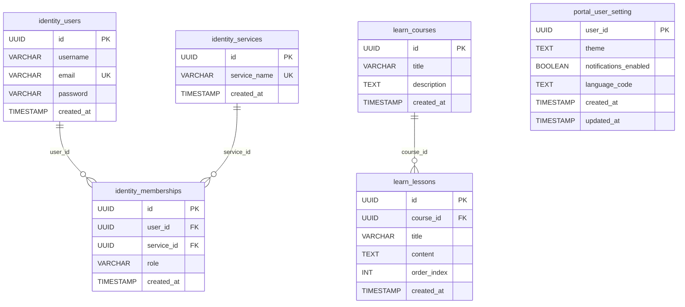

# Infrastructure — 2026-09-09

## 1. `docker-compose.yml`

Backend only; the frontend is not defined. Network `app-network` (bridge). Volumes `pgdata` (Postgres data) and `maven-repo` (`/root/.m2` cache shared by all Java containers).

All Java services run **from source** (`image: maven:…`, bind mount `./<svc>:/app`, `command: ./mvnw spring-boot:run`) — the per-service Dockerfiles are not used by compose.

| Service | Image | Ports | Env | depends_on |
| :-- | :-- | :-- | :-- | :-- |
| `postgres` | `postgres:16-alpine`, `restart: always` | `5432:5432` | `POSTGRES_DB`, `POSTGRES_USER`, `POSTGRES_PASSWORD` | — (healthcheck `pg_isready -U $POSTGRES_USER -d $POSTGRES_DB`, 10s/5s/5 retries) |
| `migrate-identity` | `flyway/flyway:11` | — | `FLYWAY_URL=jdbc:postgresql://postgres:5432/${POSTGRES_DB}`, `FLYWAY_USER`, `FLYWAY_PASSWORD`; cmd `-schemas=identity -table=identity_schema_history -locations=filesystem:/flyway/sql migrate`; mount `./infra/migrations/identity:/flyway/sql` | postgres healthy |
| `migrate-portal` | `flyway/flyway:11` | — | same pattern, `-schemas=portal -table=portal_schema_history`, mount `./infra/migrations/portal` | postgres healthy |
| `migrate-learn` | `flyway/flyway:11` | — | same pattern, `-schemas=learn -table=learn_schema_history`, mount `./infra/migrations/learn` | postgres healthy |
| `identity` | `maven:3.9.5-eclipse-temurin-21` | `8082:8080` | `SPRING_PROFILES_ACTIVE=docker`, `INTERNAL_GATEWAY_SECRET`, `DATABASE_URL=${POSTGRES_URL}`, `POSTGRES_USER`, `POSTGRES_PASSWORD`, `JWT_SECRET` | postgres healthy, `migrate-identity` completed |
| `gateway` | `maven:3.9.5-eclipse-temurin-17` | `8080:8080` | `SPRING_PROFILES_ACTIVE=docker`, `IDENTITY_SERVICE_URL`, `LEARN_SERVICE_URL`, `PORTAL_SERVICE_URL` (unused by code), `INTERNAL_GATEWAY_SECRET`, `JWT_SECRET`, `DATABASE_URL`, `POSTGRES_USER`, `POSTGRES_PASSWORD` | none |
| `portal` | `maven:3.9.5-eclipse-temurin-21` | `9000:8080` | profile, DB vars, `INTERNAL_GATEWAY_SECRET` | postgres healthy, `migrate-portal` completed |
| `learn` | `maven:3.9.5-eclipse-temurin-17` (**pom targets Java 21**) | `9002:8080` | profile, DB vars, `INTERNAL_GATEWAY_SECRET` | postgres healthy, `migrate-learn` completed |
| `community` | `maven:3.9.5-eclipse-temurin-17` | `9004:8080` | profile, DB vars | none |
| `challenge` | `maven:3.9.5-eclipse-temurin-17` | `9006:8080` | profile, DB vars | none |

No `migrate-community` / `migrate-challenge` jobs; no pgAdmin despite `.env` having pgAdmin variables.

## 2. `Makefile` (local JVMs, Postgres expected on host port `LOCAL_DB_PORT`)

Preamble: `-include .env` + `export`; `JAVA_SERVICES = identity gateway portal learn community challenge`; `SCHEMAS = identity portal learn community challenge`; `FLYWAY = ./tools/flyway/flyway`; `LOG_DIR = logs`; `SS ?= $(JAVA_SERVICES)`.

| Target | Does |
| :-- | :-- |
| `start` | `mkdir -p logs`; `wait_db` (`pg_isready -h localhost -p $(LOCAL_DB_PORT) -U $(POSTGRES_USER)` loop); `migrate_schema` (for each schema: `$(FLYWAY) -url=jdbc:postgresql://localhost:$(LOCAL_DB_PORT)/$(POSTGRES_DB) -user -password -schemas=<s> -locations=filesystem:infra/migrations/<s> migrate`); then for each service in `SS`: `cd <s> && DATABASE_URL=… POSTGRES_USER=… POSTGRES_PASSWORD=… JWT_SECRET=… INTERNAL_GATEWAY_SECRET=… ./mvnw spring-boot:run > logs/<s>.log 2>&1 &` |
| `test` | same env, `./mvnw test` per service, backgrounded, logs to `logs/<s>.log` |
| `stop` | `pkill -f "<s>/target/.*spring-boot"` per service |
| `restart` | `stop` then `$(MAKE) start SERVICES="$(SS)"` (note: passes `SERVICES`, but the variable read is `SS`) |
| `status` | `ps aux \| grep spring` |

`migrate_schema` iterates `community` and `challenge` although `infra/migrations/community` and `infra/migrations/challenge` do not exist.

## 3. `infra/start-app.sh`

1. Exports hard-coded dev values: `DATABASE_URL=jdbc:postgresql://localhost:5433/multi_service_db`, `POSTGRES_USER=appuser_dev`, `POSTGRES_DB=multi_service_db`, `POSTGRES_PASSWORD=dev_secure_password`, `JWT_SECRET=asdfghjkl-asdfghjkl-asdfghjkl-asdfghjkl`, `INTERNAL_GATEWAY_SECRET=test-secret`.
2. Loops `pg_isready -h localhost -p 5433 -U … -d …`.
3. For `identity challenge community learn portal`: `sed "s/{schema}/$schema/g" infra/flyway.conf.template > $TMP` then `./tools/flyway/flyway -configFiles=$TMP migrate`.
4. For `identity gateway portal learn community challenge`: `(cd $service && ./mvnw spring-boot:run &)`.

## 4. Flyway configuration files

`infra/flyway.conf.template`
```
flyway.url=jdbc:postgresql://localhost:5433/multi_service_db
flyway.user=appuser_dev
flyway.password=dev_secure_password
flyway.locations=filesystem:infra/migrations/{schema}
flyway.schemas={schema}
```
`infra/flyway-identity.conf` and `infra/flyway-portal.conf` are the same with `{schema}` substituted (`identity`, `portal`). No concrete conf for `learn`, `community`, `challenge`. Credentials are committed in plain text.

`tools/flyway/` — vendored Flyway 11 CLI (`flyway`, `flyway.cmd`, `conf/flyway.toml.example`, `drivers/`, `jre/`, `lib/`, `licenses/`); git-ignored, so a fresh clone cannot run `make start` without downloading it.

## 5. Migrations — `infra/migrations/`

```
identity/  V1__init_identity_schema.sql
           V2__identity_model_core.sql
           V3__identity_populate_services.sql
portal/    V1__init_portal_schema.sql
learn/     V1__learn_course_relation.sql
service-baseline/   (empty)
```

### identity

**V1__init_identity_schema.sql**
```sql
CREATE SCHEMA IF NOT EXISTS identity;
SET search_path TO identity;
CREATE TABLE users (
    id UUID PRIMARY KEY,
    username   VARCHAR(255),
    email      VARCHAR(255) NOT NULL UNIQUE,
    password   VARCHAR(255) NOT NULL,
    created_at TIMESTAMP NOT NULL DEFAULT NOW()
);
CREATE INDEX idx_users_email ON users (email);
```

**V2__identity_model_core.sql**
```sql
SET search_path TO identity;
CREATE TABLE IF NOT EXISTS services (
    id UUID PRIMARY KEY,
    service_name VARCHAR(100) NOT NULL UNIQUE,
    created_at TIMESTAMP NOT NULL DEFAULT NOW()
);
CREATE TABLE IF NOT EXISTS memberships (
    id UUID PRIMARY KEY,
    user_id UUID NOT NULL,
    service_id UUID NOT NULL,
    role VARCHAR(50) NOT NULL,
    created_at TIMESTAMP NOT NULL DEFAULT NOW(),
    CONSTRAINT fk_membership_user    FOREIGN KEY (user_id)    REFERENCES users(id),
    CONSTRAINT fk_membership_service FOREIGN KEY (service_id) REFERENCES services(id),
    CONSTRAINT uq_membership UNIQUE (user_id, service_id)
);
```

**V3__identity_populate_services.sql**
```sql
SET search_path TO identity;
INSERT INTO services (id, service_name) VALUES
    (gen_random_uuid(), 'portal'),
    (gen_random_uuid(), 'community'),
    (gen_random_uuid(), 'challenge'),
    (gen_random_uuid(), 'learn');
```

### portal

**V1__init_portal_schema.sql**
```sql
CREATE SCHEMA IF NOT EXISTS portal;
SET search_path TO portal;
CREATE TABLE user_setting (
    user_id UUID PRIMARY KEY,
    theme TEXT NOT NULL,
    notifications_enabled BOOLEAN NOT NULL,
    language_code TEXT NOT NULL,
    created_at TIMESTAMP NOT NULL DEFAULT now(),
    updated_at TIMESTAMP
);
```

### learn

**V1__learn_course_relation.sql**
```sql
CREATE SCHEMA IF NOT EXISTS learn;
SET search_path TO learn;
CREATE TABLE courses (
    id UUID PRIMARY KEY DEFAULT gen_random_uuid(),
    title VARCHAR(255) NOT NULL,
    description TEXT,
    created_at TIMESTAMP NOT NULL DEFAULT NOW()
);
CREATE TABLE lessons (
    id UUID PRIMARY KEY DEFAULT gen_random_uuid(),
    course_id UUID NOT NULL,
    title VARCHAR(255) NOT NULL,
    content TEXT,
    order_index INT NOT NULL,
    created_at TIMESTAMP NOT NULL DEFAULT NOW(),
    CONSTRAINT fk_lesson_course FOREIGN KEY (course_id) REFERENCES courses(id) ON DELETE CASCADE
);
CREATE INDEX idx_lesson_course_id ON lessons(course_id);
```

No roles/grants, functions or triggers exist in any migration. `service-baseline/` is empty.

### Entity relationship (whole database)


`portal.user_setting.user_id` logically references `identity.users.id` but there is no FK (cross-schema isolation is intentional).

## 6. `.env` (git-ignored; present locally)

| Key | Value / purpose |
| :-- | :-- |
| `POSTGRES_USER` / `POSTGRES_PASSWORD` / `POSTGRES_DB` | `appuser_dev` / `dev_secure_password` / `multi_service_db` |
| `POSTGRES_URL` | `jdbc:postgresql://postgres:5432/multi_service_db?user=…&password=…` — used as `DATABASE_URL` inside compose |
| `DATABASE_URL` | `jdbc:postgresql://localhost:5433/multi_service_db` — used by Makefile |
| `DOCKER_DB_PORT=5432`, `LOCAL_DB_PORT=5433`, `HOST_PORT_PGADMIN=5050` | ports (compose actually publishes 5432, not 5433) |
| `JWT_SECRET` | 32-char value used by identity + gateway |
| `INTERNAL_GATEWAY_SECRET` | shared gateway↔service secret |
| `JWT_SIGNING_KEY`, `OIDC_CLIENT_ID`, `OIDC_CLIENT_SECRET`, `PGADMIN_DEFAULT_EMAIL`, `PGADMIN_DEFAULT_PASSWORD` | declared, **unused** |

`.gitignore`: `.env`, `.vscode`, `target/`, `**/target/`, `tools/`, `logs/`, `copilot-instructions.md`.

## 7. CI — `.github/workflow/ci.yml`

Located in `.github/workflow/` (singular). GitHub Actions only discovers `.github/workflows/`, so **this pipeline does not run**.

Content: name "Continuous Integration Pipeline"; triggers `push` on `main`, `feature/**` and `pull_request` on `main`. Job `build_and_deploy`, matrix over `challenge community gateway identity learn portal`, `fail-fast: false`:
1. `actions/checkout@v4`
2. `actions/setup-java@v4` — temurin **JDK 11** (services require 17/21 → would fail)
3. `actions/cache@v4` on `~/.m2/repository` keyed by service `pom.xml`
4. `cd <svc> && ./mvnw clean verify -B -f pom.xml`
5. `SHOULD_PUSH` = push to `main`
6. `docker/login-action@v3` with `DOCKER_USERNAME`/`DOCKER_PASSWORD` secrets (conditional)
7. `docker/build-push-action@v5`, context `./<svc>`, tags `myregistry/<svc>:latest` and `:<sha>`

Job `integration_test` (needs `build_and_deploy`) is a single `echo` placeholder.

## 8. Logs

`logs/{challenge,community,gateway,identity,learn,portal}.log` produced by `make start`/`make test`; git-ignored.
